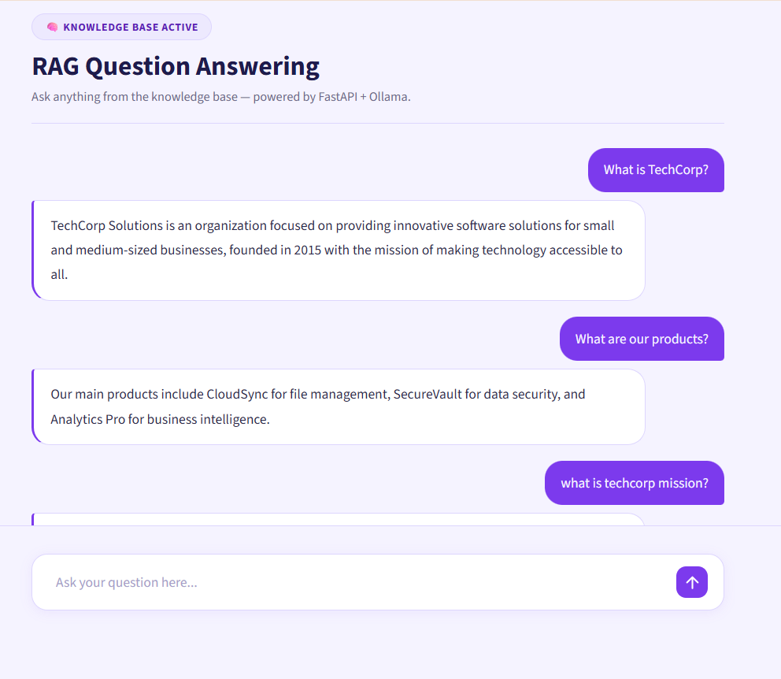
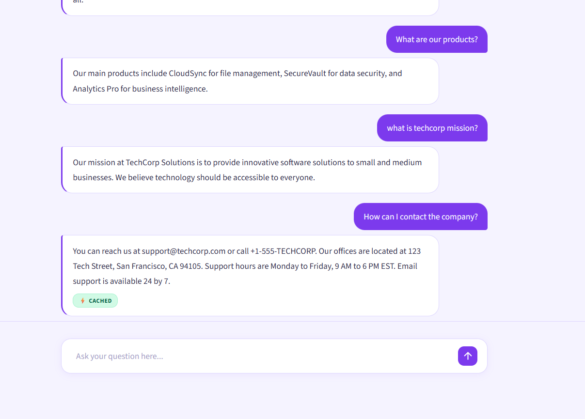

# RAG Pipeline — Question Answering System

A production-ready Retrieval Augmented Generation (RAG) pipeline that answers questions from company documents using ChromaDB, Ollama, and FastAPI. The system loads documents, chunks and embeds them, stores them in a vector database, and retrieves relevant context at query time to generate accurate answers using a local LLM.

---

## Screenshots

### Chat Interface


*RAG-powered chatbot answering questions from the company knowledge base.*

### Cached Response


*Repeated queries are served instantly from Redis cache (⚡ CACHED badge visible).*

---

## Project Structure

```
RAG_PROJECT/
│
├── data/
│   ├── faqs/
│   │   └── faqs.txt                    # FAQ Q&A pairs
│   ├── html/
│   │   └── about.html                  # Company HTML page
│   ├── pdfs/
│   │   └── TechCorp_KnowledgeBase.pdf  # Company PDF document
│   ├── vector_store/                   # ChromaDB persistent storage (auto-generated)
│   └── training_data.json              # Fine-tuning dataset in Alpaca format
│
├── docs/
│   └── screenshots/
│       ├── chat_interface.png          # Chat UI screenshot
│       └── chat_cached_response.png    # Redis cached response screenshot
│
├── logs/
│   └── app.log                         # Application logs
│
├── src/
│   ├── api/
│   │   ├── middleware/
│   │   │   └── timing.py               # Adds X-Response-Time header to responses
│   │   ├── routes/
│   │   │   └── ask.py                  # POST /ask endpoint
│   │   ├── __init__.py
│   │   └── schemas.py                  # Pydantic request and response schemas
│   │
│   ├── core/
│   │   ├── __init__.py
│   │   ├── rag_pipeline.py             # Core RAG chain — retrieves context and calls LLM
│   │   └── retriever.py                # ChromaDB retriever with similarity threshold
│   │
│   ├── ingestion/
│   │   ├── __init__.py
│   │   ├── chunker.py                  # Splits documents into smaller chunks
│   │   ├── data_ingestion.py           # Runs the full ingestion pipeline
│   │   ├── embedding.py                # Generates embeddings using SentenceTransformer
│   │   └── loaders.py                  # Loads TXT, PDF (pdfplumber), and HTML files
│   │
│   ├── store/
│   │   ├── __init__.py
│   │   └── vectorstore.py              # Stores embeddings and documents in ChromaDB
│   │
│   └── utils/
│       ├── __init__.py
│       ├── guardrails.py               # Validates LLM responses before returning
│       └── logger.py                   # Centralized logging setup
│
├── .env                                # Environment variables
├── .gitignore
├── app.py                              # FastAPI app — startup, middleware, routes
├── config.py                           # All configuration settings
├── Modelfile                           # Ollama custom model definition
└── requirements.txt                    # Python dependencies
```

---

## How It Works

The system is split into two phases — **Ingestion** (run once) and **Query** (run on every user question).

### Phase 1 — Ingestion (One Time Setup)

Before the API can answer questions, all company documents must be processed and stored in the vector database. This is done by running the ingestion pipeline once.

- **Document Loading** — The `loaders.py` module reads all files from the `data/` folder. TXT files are loaded using LangChain's `TextLoader`, HTML files using `BSHTMLLoader`, and PDF files using `pdfplumber` which also handles structured table extraction. Each file becomes one or more LangChain `Document` objects with metadata like source file and page number.

- **Chunking** — The `chunker.py` module splits each document into smaller overlapping chunks using `RecursiveCharacterTextSplitter`. A chunk size of 300 characters with an overlap of 100 characters is used. Smaller chunks improve retrieval precision — each chunk focuses on one specific topic rather than mixing multiple topics together.

- **Embedding Generation** — The `embedding.py` module passes each chunk through the `all-MiniLM-L6-v2` SentenceTransformer model, which converts each chunk of text into a 384-dimensional numerical vector. Similar text will produce similar vectors — this is what allows semantic search to work.

- **Vector Storage** — The `vectorstore.py` module stores all chunk texts, their embeddings, and metadata into ChromaDB, a persistent local vector database. ChromaDB saves everything to disk in `data/vector_store/` so it does not need to be rebuilt every time the server starts.

### Phase 2 — Query (Every User Request)

When a user sends a question to the `/ask` endpoint, the following steps happen:

- **Query Embedding** — The user's question is converted into a 384-dimensional embedding using the same `all-MiniLM-L6-v2` model that was used during ingestion. This ensures the query vector is in the same space as the document vectors.

- **Semantic Retrieval** — The `retriever.py` module queries ChromaDB with the question embedding and retrieves the top 2 most similar chunks using cosine similarity. Chunks with a similarity score below 0.30 are filtered out to avoid passing irrelevant context to the LLM.

- **Prompt Construction** — The retrieved chunks are joined together to form a context block. This context, along with the original question and a system prompt, is formatted into a single prompt for the LLM.

- **LLM Answer Generation** — The prompt is sent to the `techcorp-assistant` model running locally via Ollama. The model is instructed to answer only using the provided context and to respond with "I don't know" if the answer is not present in the documents.

- **Guardrail Validation** — The `guardrails.py` module checks the LLM response before it is returned to the user. This prevents hallucinated or unsafe responses from reaching the user.

- **Caching** — Responses are cached in Redis. If the same question is asked again, the cached answer is returned immediately without calling the LLM again, significantly reducing response time.

---

## Fine-Tuning

A dataset of **65 Q&A pairs** has been prepared in **Alpaca format** (`data/training_data.json`) based on the actual company documents. Alpaca format is a standard supervised fine-tuning format used for large language models where each entry contains three fields.

- **instruction** — The system role and behavioral rules for the assistant
- **input** — The retrieved context from documents combined with the user question
- **output** — The ideal expected answer

Each entry looks like this:

```json
{
  "instruction": "You are a customer support assistant. Answer ONLY using the provided context. If the answer is not in the context, say: I don't know.",
  "input": "Context: We offer a 30-day return policy.\n\nQuestion: What is the return policy?",
  "output": "We offer a 30-day return policy for all products."
}
```

Since external fine-tuning tools were not used at this stage, Ollama's **Modelfile approach** was used as an alternative for model customization. The `Modelfile` uses `FROM llama3.2` to set llama3.2 as the base model and defines a `SYSTEM` prompt with specific behavioral rules — answer only from context, do not hallucinate, and respond with "I don't know" for out-of-scope questions. This creates the `techcorp-assistant` custom model.

---

## Setup & Installation

### Prerequisites

- Python 3.10+
- Ollama installed and running
- Redis installed and running
- llama3.2 model pulled in Ollama

```bash
ollama pull llama3.2
```

### Step 1 — Clone the repository

```bash
git clone https://github.com/JaspinderKaurWalia26/rag_pipeline.git
cd rag_pipeline
```

### Step 2 — Create virtual environment

```bash
python -m venv venv

# Windows
venv\Scripts\activate

# Mac/Linux
source venv/bin/activate
```

### Step 3 — Install dependencies

```bash
pip install -r requirements.txt
```

### Step 4 — Configure environment variables

Create a `.env` file in the project root

### Step 5 — Create custom Ollama model

```bash
ollama create techcorp-assistant -f Modelfile
```

### Step 6 — Run data ingestion

```bash
python -m src.ingestion.data_ingestion
```

### Step 7 — Start the FastAPI server

```bash
python -m uvicorn app:app --reload
```

The API will be available at `http://127.0.0.1:8000`  
Swagger UI (Interactive API docs): `http://127.0.0.1:8000/docs`

### Step 8 — Run the Streamlit UI

Open a new terminal (keep the FastAPI server running) and run:

```bash
streamlit run main.py
```

The chat interface will be available at `http://localhost:8501`

---